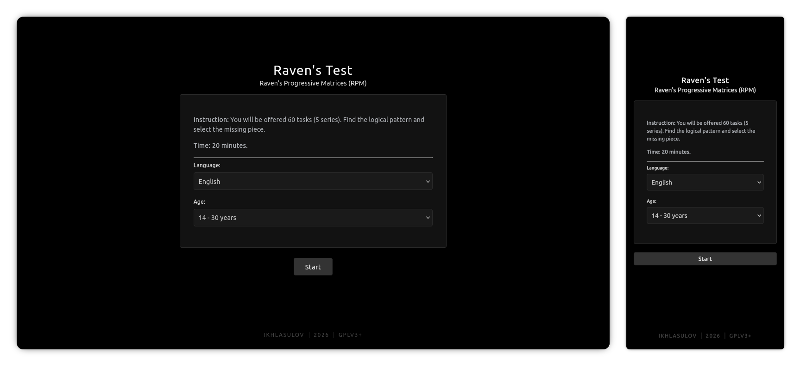
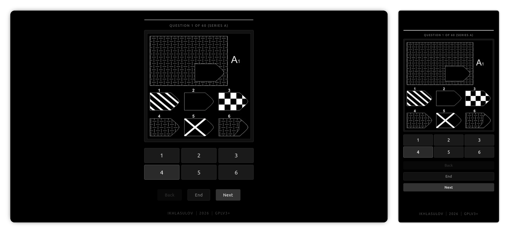

<p align="center">
  
</p>

<h1 align="center">🧠 Open RPM — Raven's Progressive Matrices</h1>

<p align="center">
  <b>Beautiful, private, client-side IQ test.</b><br/>
  Vanilla JS • No tracking • 60 matrices • Results in seconds
</p>

<p align="center">
  <a href="https://github.com/Xeven777/OpenRpm"></a>
  <a href="https://www.gnu.org/licenses/gpl-3.0.html"></a>
  
  
  
</p>

<p align="center">
  🔗 <b>Repo:</b> <a href="https://github.com/Xeven777/OpenRpm">github.com/Xeven777/OpenRpm</a><br/>
  🚀 <b>Live:</b> <code>https://xeven777.github.io/OpenRpm/</code> (after Pages enable)
</p>

---

## ✨ Features

- 🧠 **True Raven's 60** — 5 series `A-E` ( `A/B` 6 options, `C/D/E` 8 options ), 20-minute timer with visual countdown
- 🎂 **Age-fair scoring** — `14-15` · `16-17` · `18-30` (peak) · `31-35` → `56+` with correction `finalIQ = round(baseIQ*100/agePercent)` — fair for teens & older adults
- 📊 **IQ + Percentile** — cubic spline `raw → baseIQ` (`30→82, 40→95, 50→110`) + normal CDF (`118 → 88th percentile`)
- 📈 **Beautiful results** — hero `Instrument Serif` IQ, bell curve (55-145) with your marker + 5-axis radar `A-E` (solid = you, dashed = expected)
- 🔗 **Share & PDF** — one-tap `Share` + `Download PDF` / print
- ⚡ **Fast & smooth** — parallel preload, instant image swap, no framework
- ⌨️ **Keyboard & a11y** — `1-8` to answer, `←/→` + `Enter` to navigate, `button[role=radio]` + `focus-visible`
- 💾 **Resilient** — auto-saves to `localStorage`, resume modal if you refresh (24h)
- 🔤 **Polished type** — **Inter** + **Instrument Serif** via Google Fonts, dark premium UI
- 🔒 **Private** — 100% local, no server, no tracking
- 🌐 **English** — clean single-language bundle

---

## 🧩 How it works

<p align="center">
  
</p>

1. **Pick age** → `Age 18-30` is peak (100), teens `14-15`/`16-17` get small boost, `56+` gets +42% (`70` denominator)
2. **20 min, 60 matrices** — 5 series `A-E` (`A/B` 6 options, `C/D/E` 8 options). Progress: `Question 7 of 60 (Series B)` + thin timer bar (white → orange → red)
3. **Scoring:**
   ```js
   // script.js:121, 590
   baseIQ = splineInterpolate(rawScore) // 0→0, 30→82, 40→95, 50→110, 60→140
   finalIQ = Math.round(baseIQ * 100 / agePercent)
   percentile = normalCDF((finalIQ-100)/15) // 118 → 88th
   ```

<p align="center">
  
</p>

4. **Reliability** — compares each series `A-E` vs `NORMATIVE_DISTRIBUTION` (`script.js:8`). If `Series A` deviation ≤ -3 or >2 series deviate >2 → flagged as unreliable / attention drift.

---

## 🎨 Stack

- **No framework** — `index.html` + `style.css` + `script.js` + `answers.js` (base64) + `translations.js`
- **66 SVGs** in `images/1.svg…60.svg` (potrace)
- **Fonts** via CDN — no local `fonts/ubuntu.ttf` needed
- **Storage** — `raven_age`, `raven_progress_v1` in `localStorage`

---

## 📁 Structure

```
.
├── index.html        # single page — intro / test / results-v2
├── style.css         # Inter + dark tokens + radar/bell styles + print
├── script.js         # RavenApp, spline, preload×6, keyboard, radar/bell SVG
├── translations.js   # en only (age_14_15 etc.)
├── answers.js        # base64 answer key
├── images/1.svg…60.svg
└── favicon/
```

---

## 📖 Docs

Scoring & norms from the clinical manual:
- [Тест Равена. Шкала прогрессивных матриц.](README/Тест_Равена._Шкала_прогрессивных_матриц..pdf)

---

## 🤝 Contributing

PRs welcome!

---

## 📜 License

**GPLv3+** — see [LICENSE](LICENSE). Share, fork, improve. 💚

<p align="center">Made with 🧠 + ☕ by <a href="https://github.com/Xeven777">Xeven</a></p>
